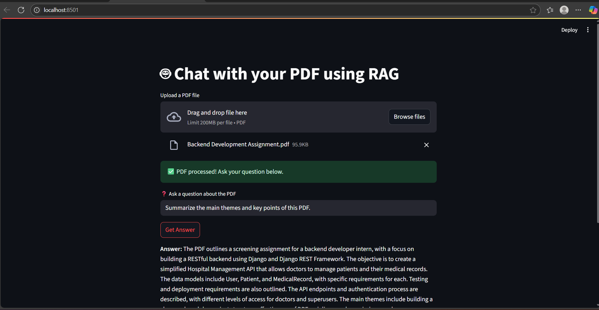

# 📚 PDF RAG Chatbot

A simple and powerful PDF chatbot using [LangChain](https://www.langchain.com/), [OpenAI](https://platform.openai.com/), and [Streamlit](https://streamlit.io/). Upload a PDF and ask natural language questions about its content — built using RAG (Retrieval-Augmented Generation).

---

## 🚀 Features

- ✅ Upload any text-based PDF
- 🤖 Ask questions in natural language
- 🔎 Powered by LangChain + FAISS for retrieval
- 🧠 Uses OpenAI's GPT-4 or GPT-3.5 for answering
- 🖥️ Streamlit-based web interface
- ☁️ Deployable to Render or any cloud platform

---

## 📸 Demo



---

## 🛠️ Tech Stack

- Python 3.8+
- Streamlit
- LangChain
- OpenAI
- FAISS
- dotenv

---

## 📦 Setup Instructions

### 1. Clone the repo

```bash
git clone https://github.com/Ashishkumar667/Pdf_chatbot.git
cd Pdf_chatbot

2.Install dependencies
pip install -r requirements.txt

3. create .env
OPENAI_API_KEY=your_openai_api_key

4.Run Locally
streamlit run app.py

Visit http://localhost:8501 in your browser.
